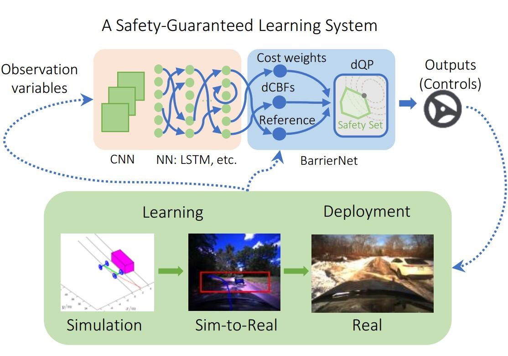

# BarrierNet

A safety guaranteed neural network controller for autonomous systems 

 

There are three simple control demos (traffic merging, 2D and 3D robot control) and one vision-based end-to-end autonomous driving demo.

## Setup
```
conda create -n bnet python=3.8
conda activate bnet
pip install torch==1.10.1+cu113 torchvision==0.11.2+cu113 -f https://download.pytorch.org/whl/cu113/torch_stable.html
pip install pytorch-lightning==1.5.8 opencv-python==4.5.2.54 matplotlib==3.5.1 ffio==0.1.0  descartes==1.1.0  pyrender==0.1.45  pandas==1.3.5 shapely==1.7.1 scikit-video==1.1.11 scipy==1.6.3 h5py==3.1.0
pip install qpth cvxpy cvxopt
```
Install `vista`.
```
conda activate bnet
cd vista
pip install -e .
```

## Testing vision-based driving in VISTA
Download trained Barrier_Net: https://drive.google.com/file/d/1vkBTsmFeh_c3qDkqCnKBi-S2pAFsj2q8/view?usp=drive_link

Download trained state_net: https://drive.google.com/file/d/1bFFO6S4GYdSP3eCiStAg2orK9MXXoMWU/view?usp=drive_link

Download testing trace: https://drive.google.com/file/d/1z3BN9DbDDc0o1qir7VF64Rf5t-4F6czW/view?usp=drive_link

Download carpark01 (for VISTA): https://drive.google.com/file/d/13ENk6GEKGUfIkVc4Na0CiWlUCMJRqew5/view?usp=drive_link
```
bash scripts/eval_example.sh --trace-paths ./fakepath/20220113-131922_lexus_devens_outerloop_reverse --ckpt ./fakepath/epoch\=9-step\=29239.ckpt --state-net-ckpt ./fakepath/epoch=7-step=36374.ckpt --mesh-dir ./fakepath/carpack01/
```

## Reference
If you find this useful, please cite our work:
```
@article{xiao2023bnet,
        title={BarrierNet: Differentiable Control Barrier Functions for Learning of Safe Robot Control},
        author={Wei Xiao and Tsun-Hsuan Wang and Ramin Hasani and Makram Chahine and Alexander Amini and Xiao Li and Daniela Rus},
        journal={IEEE Transactions on Robotics},
        year={2023},
        publisher={IEEE}
    }
```
